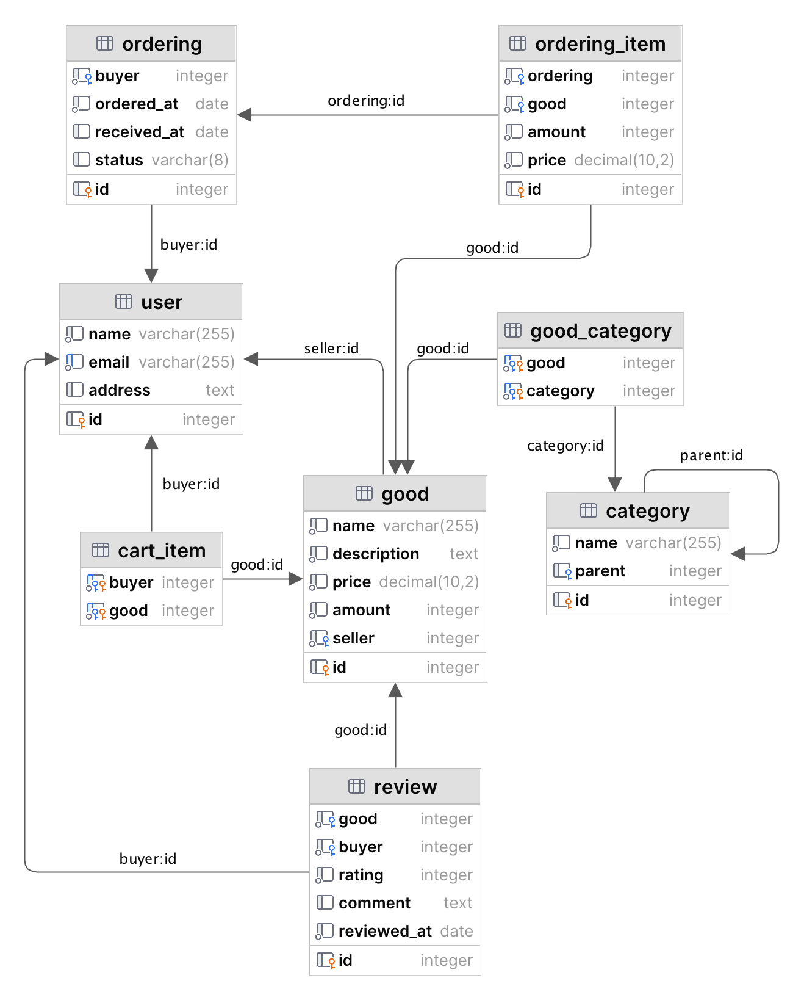

# НИЯУ МИФИ. Лабораторная работа №1. Краснопольский Иван, Б21-525. 2024

## Предметная область

Интернет-магазин в формате площадки объявлений, где пользователь может одновременно выполнять роли продавца и
покупателя. В качестве продавца, пользователь размещает товары для продажи, которые классифицируются по категориям с
возможностью наличия родительских категорий. Покупатель может добавлять товары в корзину и формировать из них заказ,
который может состоять из нескольких товаров. Заказы обладают статусами: в ожидании отправки, передан в доставку,
получен. Пользователи имеют возможность оставлять отзывы на товары, которые включают в себя численную оценку в диапазоне
от 0 до 5 и текстовый комментарий.

## Модель базы данных

### Используемые таблицы

#### Пользователи

- `id`: первичный ключ
- `name`: имя пользователя
- `email`: уникальный электронный адрес
- `address`: адрес пользователя для доставки товаров

#### Категории

- `id`: первичный ключ
- `name`: название категории
- `parent`: внешний ключ на идентификатор родительской категории для иерархической структуры

#### Товары

- `id`: первичный ключ
- `name`: название товара
- `description`: описание товара
- `price`: цена товара
- `amount`: количество товара в наличии
- `seller`: внешний ключ на идентификатор пользователя, выступающего в роли продавца

#### Категории товаров

- `good`: внешний ключ на идентификатор товара
- `category`: внешний ключ на идентификатор категории
- (`good`, `category`): составной первичный ключ

#### Товары в корзине

- `buyer`: внешний ключ на идентификатор пользователя
- `good`: внешний ключ на идентификатор товара
- (`buyer`, `good`): составной первичный ключ

#### Заказы

- `id`: первичный ключ
- `buyer`: внешний ключ на идентификатор пользователя
- `ordered_at`: дата оформления заказа
- `received_at`: дата получения заказа
- `status`: статус заказа, может принимать значения PENDING, SHIPPING, RECEIVED

#### Позиции заказа

- `id`: первичный ключ
- `ordering`: внешний ключ на идентификатор заказа
- `good`: внешний ключ на идентификатор товара
- `amount`: размер позиции
- `price`: цена за единицу товара в момент заказа

#### Отзывы

- `id`: первичный ключ
- `good`: внешний ключ на идентификатор товара
- `buyer`: внешний ключ на идентификатор пользователя
- `rating`: численная оценка в диапазоне от 0 до 5.
- `comment`: текстовый комментарий к отзыву
- `reviewed_at`: дата оставления отзыва

### Оценка нормальная форма

1. База данных удовлетворяет нулевой нормальной форме
    - Порядок строк не имеет значения
    - Порядок столбцов не имеет значения
2. База данных удовлетворяет первой нормальной форме
    - База данных удовлетворяет нулевой нормальной форме
    - В таблицах не может быть дублирующихся строк
    - В каждой ячейке хранится атомарное значение
    - В каждом столбце хранится только определенный тип данных
3. База данных удовлетворяет второй нормальной форме
    - База данных удовлетворяет первой нормальной форме
    - Все таблицы имеют первичный ключ
    - Таблицы отношений many-to-many имеют составной первичный ключ
4. База данных удовлетворяет третьей нормальной форме
    - База данных удовлетворяет второй нормальной форме
    - Неключевые столбцы не зависят от других неключевых столбцов
5. База данных удовлетворяет нормальной форме Бойса-Кодда
    - База данных удовлетворяет третьей нормальной форме
    - Таблицы, содержащие составные первичные ключи, не содержат неключевые столбцы

Таким образом, база данных удовлетворяет как минимум нормальной форме Бойса-Кодда

## Реализация базы данных

### Диаграмма отношений сущностей

### SQL сценарии

1. [Создание таблиц](scripts/01-create-tables.sql)

## Заключение

В ходе данной работы была спроектирована база данных для интернет магазина. Оценка нормальной формы показала, что база
данных удовлетворяет как минимум нормальной форме Бойса-Кодда. Была составлена диаграмма отношений сущностей и
реализован SQL-сценарий инициализации базы данных.
