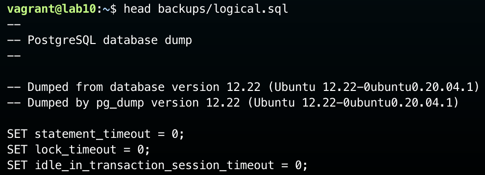
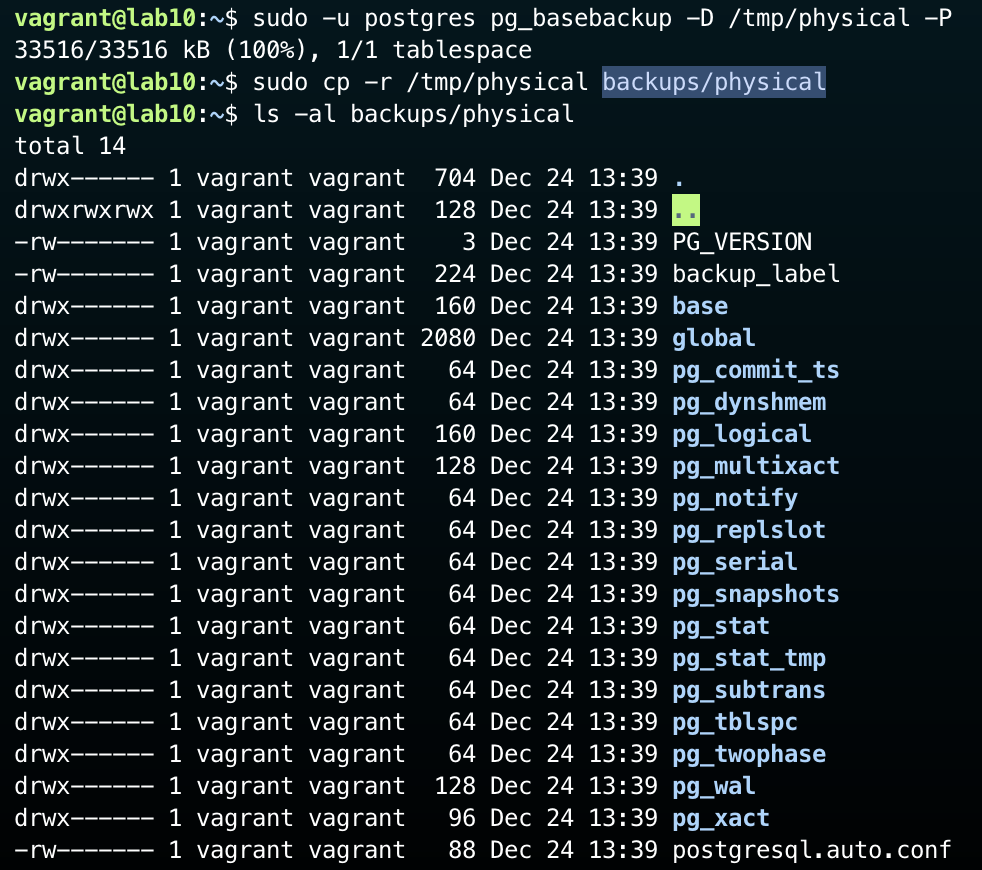
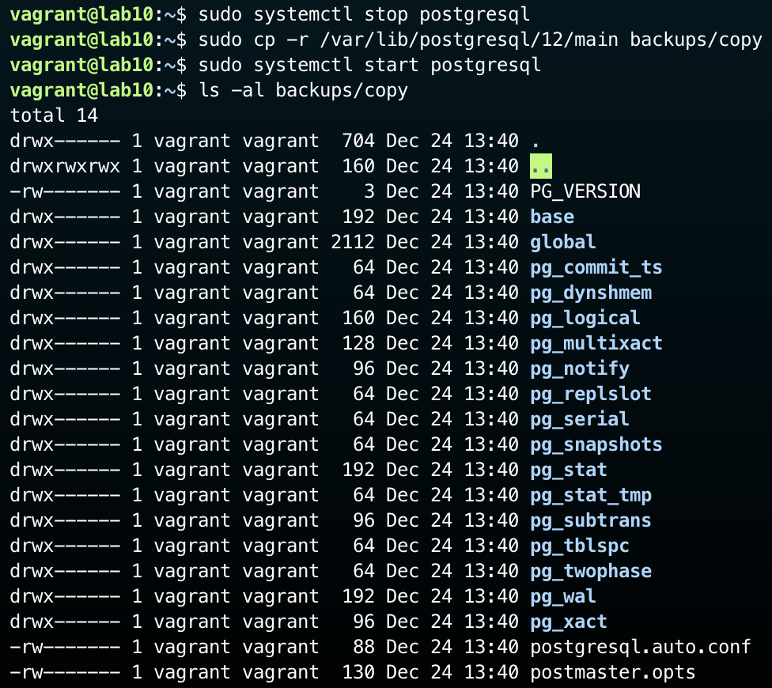
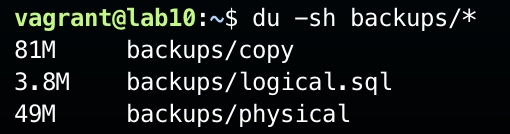
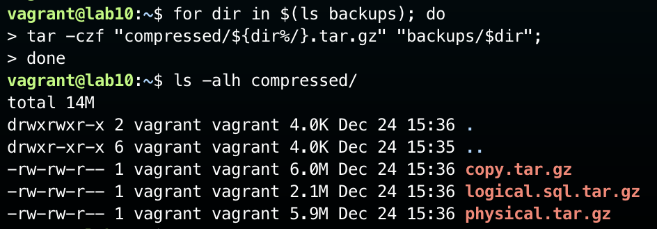
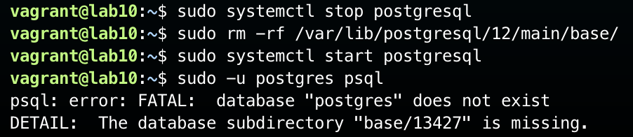
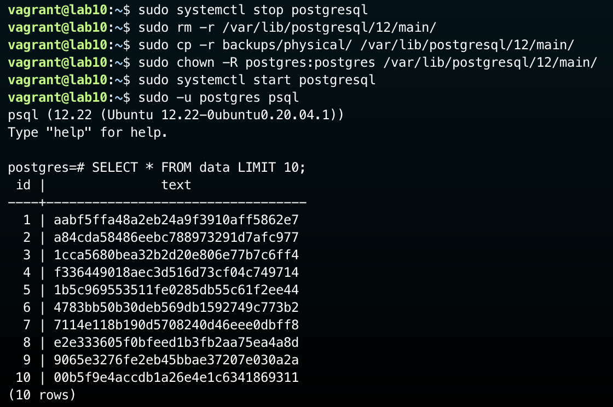

# НИЯУ МИФИ. Лабораторная работа №10. Краснопольский Иван, Б21-525. 2024

## Vagrant сценарии

1. [Инициализация виртуальной машины](Vagrantfile)

## Наполнение данными


## Снятие копии базы данных

### Логическая копия



#### Структура копии

##### Заголовок

```sql
--
-- PostgreSQL database dump
--

-- Dumped from database version 12.22 (Ubuntu 12.22-0ubuntu0.20.04.1)
-- Dumped by pg_dump version 12.22 (Ubuntu 12.22-0ubuntu0.20.04.1)
```

##### Установка параметров для запуска

```sql
SET statement_timeout = 0;
SET lock_timeout = 0;
SET idle_in_transaction_session_timeout = 0;
SET client_encoding = 'UTF8';
SET standard_conforming_strings = ON;
SELECT pg_catalog.set_config('search_path', '', FALSE);
SET check_function_bodies = FALSE;
SET xmloption = content;
SET client_min_messages = warning;
SET row_security = OFF;

SET default_tablespace = '';

SET default_table_access_method = heap;
```

##### Создание схем

```sql
--
-- Name: data; Type: TABLE; Schema: public; Owner: postgres
--

CREATE TABLE public.data
(
    id   INTEGER                NOT NULL,
    text character varying(255) NOT NULL
);


ALTER TABLE public.data OWNER TO postgres;
```

##### Создание последовательностей

```sql
--
-- Name: data_id_seq; Type: SEQUENCE; Schema: public; Owner: postgres
--

CREATE
SEQUENCE public.data_id_seq
    AS INTEGER
    START WITH 1
    INCREMENT BY 1
    NO MINVALUE
    NO MAXVALUE
    CACHE 1;


ALTER TABLE public.data_id_seq OWNER TO postgres;

--
-- Name: data_id_seq; Type: SEQUENCE OWNED BY; Schema: public; Owner: postgres
--

ALTER
SEQUENCE public.data_id_seq OWNED BY public.data.id;


--
-- Name: data id; Type: DEFAULT; Schema: public; Owner: postgres
--

ALTER TABLE only public.data ALTER COLUMN id SET DEFAULT nextval('public.data_id_seq'::regclass);
```

##### Создание данных

```sql
--
-- Data for Name: data; Type: TABLE DATA; Schema: public; Owner: postgres
--

COPY public.data (id, TEXT) FROM stdin;
1	aabf5ffa48a2eb24a9f3910aff5862e7
2	a84cda58486eebc788973291d7afc977
3	1cca5680bea32b2d20e806e77b7c6ff4
4	f336449018aec3d516d73cf04c749714
...
```

##### Создание ключей

```sql
--
-- Name: data data_pkey; Type: CONSTRAINT; Schema: public; Owner: postgres
--

ALTER TABLE only public.data
    ADD CONSTRAINT data_pkey PRIMARY KEY (id);
```

### Физическая копия через pg_basebackup



### Физическая копия через копирование файлов



### Сравнение размеров

#### В несжатом виде



#### В сжатом виде



## Восстановление базы данных

### Повреждение данных



### Восстановление из физической копии



## Заключение

В ходе выполнения лабораторной работы были изучены средства восстановления базы данных:

- Осуществлено создание логической и физической (через pg_basebackup и копирование файлов) копий базы данных
- Изучена структура файла логической копии
- Проведено сравнение размеров копий в несжатом и сжатом виде
- Осуществлено восстановление базы данных из физической копии
