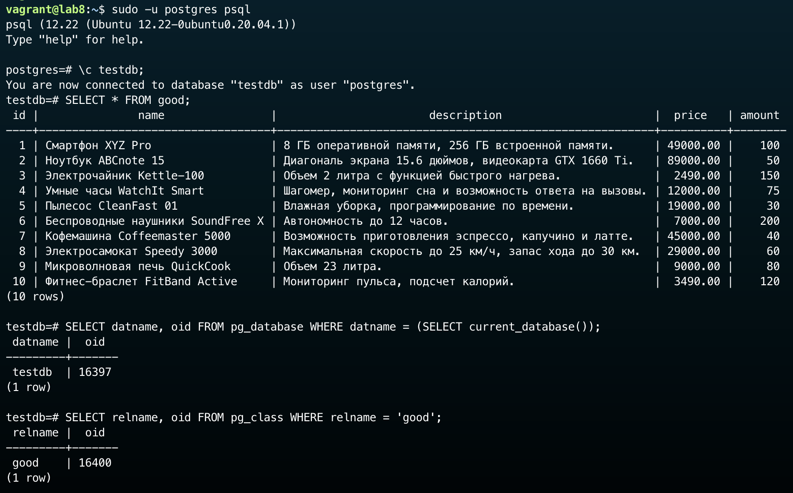
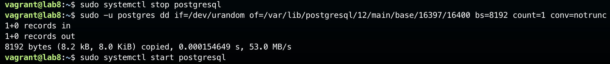
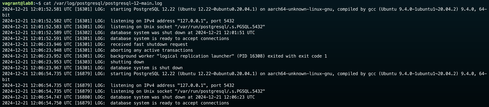
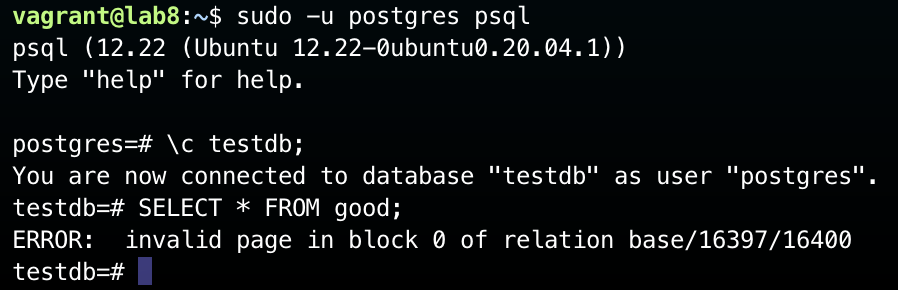

# НИЯУ МИФИ. Лабораторная работа №8. Краснопольский Иван, Б21-525. 2024

## Vagrant сценарии

1. [Инициализация виртуальной машины](Vagrantfile)

## Изучение кластера базы данных

### Команда запуска кластера

### Расположение кластера


Кластер баз данных PostgreSQL располагается в директории `/var/lib/postgresql/12/main`, что видно из команды запуска
демона postgres

### Файловая структура кластера


В директории кластера расположены следующие файлы и директории:

- `base` - директория с базами данных)
- `global` - директория с общими объектами кластера)
- `pg_commit_ts`, `pg_dynshmem`, `pg_logical` и другие служебные директории
- `postgresql.auto.conf` - файл конфигурации
- `postmaster.opts` - параметры запуска
- `PG_VERSION` - файл с версией PostgreSQL

### Команда запуска кластера

```bash
/usr/lib/postgresql/12/bin/postgres -D /var/lib/postgresql/12/main -c config_file=/etc/postgresql/12/main/postgresql.conf
```

## Администрирование кластера базы данных

### Остановка кластера


### Запуск кластера


### Проверка работоспособности кластера


## Управление базами данных

### Создание базы данных


Создана база данных `testdb`:

- Владельцем новой базы данных является пользователь `postgres`
- Изначально база данных пустая
- База данных создана с кодировкой `UTF-8` и локалью `en_US.UTF-8`

### Проверка изоляции баз данных


- При попытке обратиться к таблице `test_table` из базы `postgres` получена ошибка о несуществующей таблице
- При попытке обратиться к таблице `original_table` из базы `testdb` получена ошибка о несуществующей таблице

Это подтверждает, что базы данных действительно изолированы друг от друга, и объекты одной базы данных недоступны из
другой.

## Нарушение целостности данных

### Проверка существования данных



Файл данных таблицы `good` базы данных `testdb` находится по пути `/var/lib/postgresql/12/main/base/16397/16400`

### Частичное повреждение файла данных

Повредим 8 килобайт файла данных таблицы `good` базы данных `testdb`:



При перезапуске демона PostgreSQL, в логах нет сообщений о повреждении данных:



Однако, при попытке получить данные из таблицы, запрос возвращает ошибку:



## Заключение

В ходе выполнения лабораторной работы были изучены базовые механизмы администрирования PostgreSQL:

- Исследована структура и расположение кластера PostgreSQL в файловой системе
- Изучены основные файлы и директории, входящие в состав кластера
- Изучены команды управления сервером PostgreSQL: завершение работы и запуск сервера
- Осуществлено создание баз данных и проверка изоляции между ними
- Проверена работоспособность сервера PostgreSQL:
  - После повреждения файлов данных сервер доступен и отвечает на запросы
  - Запросы к поврежденной таблице возвращают ошибку
