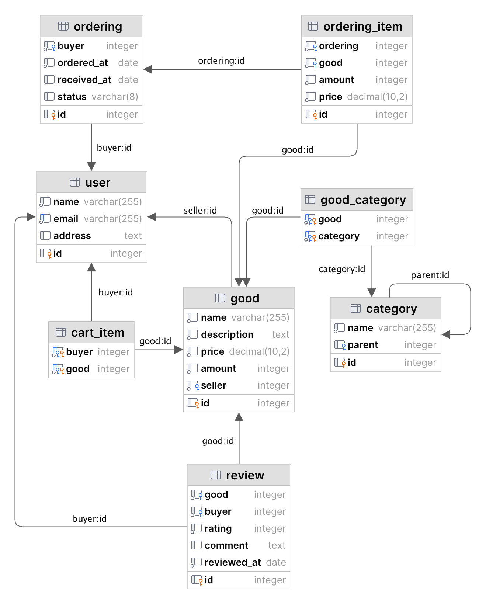

# НИЯУ МИФИ. Лабораторная работа №9. Краснопольский Иван, Б21-525. 2024

## SQL сценарии

1. [Создание таблиц](scripts/01-create-tables.sql)
2. [Получение статистики до наполнения данными](scripts/02-01-statistics.sql)
3. [Наполнение данными](scripts/02-02-populate-tables.sql)
4. [Получение статистики после наполнения данными](scripts/02-03-statistics.sql)
5. [Выборка данных до создания индексов](scripts/03-01-select-data.sql)
6. [Создание индексов](scripts/03-02-create-indexes.sql)
7. [Выборка данных после создания индексов](scripts/03-03-select-data.sql)
8. [Оценка размеров таблиц и индексов](scripts/04-index-size.sql)

## Схема данных



## Статистика о таблицах схемы данных

### Статистика до наполнения данными

#### SQL запрос

```sql
SELECT schemaname,
       relname             AS "table_name",
       n_live_tup          AS "rows_count",
       n_dead_tup          AS "dead_rows",
       n_mod_since_analyze AS "changes_since_analyze",
       last_analyze        AS "last_analyze",
       last_autoanalyze    AS "last_autoanalyze"
FROM pg_stat_user_tables
WHERE schemaname = 'public';
```

#### Полученный результат

| schemaname | table\_name    | rows\_count | dead\_rows | changes\_since\_analyze | last\_analyze | last\_autoanalyze |
|:-----------|:---------------|:------------|:-----------|:------------------------|:--------------|:------------------|
| public     | ordering       | 0           | 0          | 0                       | null          | null              |
| public     | ordering\_item | 0           | 0          | 0                       | null          | null              |
| public     | user           | 0           | 0          | 0                       | null          | null              |
| public     | cart\_item     | 0           | 0          | 0                       | null          | null              |
| public     | category       | 0           | 0          | 0                       | null          | null              |
| public     | good\_category | 0           | 0          | 0                       | null          | null              |
| public     | review         | 0           | 0          | 0                       | null          | null              |
| public     | good           | 0           | 0          | 0                       | null          | null              |

### Статистика после наполнения данными

#### SQL запрос

```sql
SELECT schemaname,
       relname             AS "table_name",
       n_live_tup          AS "rows_count",
       n_dead_tup          AS "dead_rows",
       n_mod_since_analyze AS "changes_since_analyze",
       last_analyze        AS "last_analyze",
       last_autoanalyze    AS "last_autoanalyze"
FROM pg_stat_user_tables
WHERE schemaname = 'public';
```

#### Полученный результат

| schemaname | table\_name    | rows\_count | dead\_rows | changes\_since\_analyze | last\_analyze | last\_autoanalyze |
|:-----------|:---------------|:------------|:-----------|:------------------------|:--------------|:------------------|
| public     | ordering       | 80          | 0          | 80                      | null          | null              |
| public     | ordering\_item | 312         | 0          | 312                     | null          | null              |
| public     | user           | 10          | 0          | 10                      | null          | null              |
| public     | cart\_item     | 29          | 0          | 29                      | null          | null              |
| public     | category       | 17          | 0          | 17                      | null          | null              |
| public     | good\_category | 10          | 0          | 10                      | null          | null              |
| public     | review         | 20          | 0          | 20                      | null          | null              |
| public     | good           | 10          | 0          | 10                      | null          | null              |

### Запуск анализа

#### SQL запрос

```sql
ANALYZE verbose;
```

#### Полученный результат

```text
analyzing "pg_catalog.pg_type"
"pg_type": scanned 15 of 15 pages, containing 635 live rows and 96 dead rows; 635 rows in sample, 635 estimated total rows
analyzing "pg_catalog.pg_foreign_table"
"pg_foreign_table": scanned 0 of 0 pages, containing 0 live rows and 0 dead rows; 0 rows in sample, 0 estimated total rows
analyzing "pg_catalog.pg_authid"
"pg_authid": scanned 1 of 1 pages, containing 16 live rows and 0 dead rows; 16 rows in sample, 16 estimated total rows
analyzing "public.ordering"
"ordering": scanned 1 of 1 pages, containing 80 live rows and 0 dead rows; 80 rows in sample, 80 estimated total rows
analyzing "pg_catalog.pg_statistic_ext_data"
"pg_statistic_ext_data": scanned 0 of 0 pages, containing 0 live rows and 0 dead rows; 0 rows in sample, 0 estimated total rows
analyzing "public.category"
"category": scanned 1 of 1 pages, containing 17 live rows and 0 dead rows; 17 rows in sample, 17 estimated total rows
analyzing "public.user"
"user": scanned 1 of 1 pages, containing 10 live rows and 0 dead rows; 10 rows in sample, 10 estimated total rows
analyzing "public.good"
"good": scanned 1 of 1 pages, containing 10 live rows and 0 dead rows; 10 rows in sample, 10 estimated total rows
analyzing "public.good_category"
"good_category": scanned 1 of 1 pages, containing 10 live rows and 0 dead rows; 10 rows in sample, 10 estimated total rows
analyzing "public.cart_item"
"cart_item": scanned 1 of 1 pages, containing 29 live rows and 0 dead rows; 29 rows in sample, 29 estimated total rows
analyzing "public.ordering_item"
"ordering_item": scanned 3 of 3 pages, containing 312 live rows and 0 dead rows; 312 rows in sample, 312 estimated total rows
analyzing "public.review"
"review": scanned 1 of 1 pages, containing 20 live rows and 0 dead rows; 20 rows in sample, 20 estimated total rows
analyzing "pg_catalog.pg_user_mapping"
"pg_user_mapping": scanned 0 of 0 pages, containing 0 live rows and 0 dead rows; 0 rows in sample, 0 estimated total rows
analyzing "pg_catalog.pg_subscription"
"pg_subscription": scanned 0 of 0 pages, containing 0 live rows and 0 dead rows; 0 rows in sample, 0 estimated total rows
analyzing "pg_catalog.pg_attribute"
"pg_attribute": scanned 69 of 69 pages, containing 3294 live rows and 177 dead rows; 3294 rows in sample, 3294 estimated total rows
analyzing "pg_catalog.pg_proc"
"pg_proc": scanned 99 of 99 pages, containing 3361 live rows and 0 dead rows; 3361 rows in sample, 3361 estimated total rows
analyzing "pg_catalog.pg_class"
"pg_class": scanned 14 of 14 pages, containing 442 live rows and 63 dead rows; 442 rows in sample, 442 estimated total rows
analyzing "pg_catalog.pg_attrdef"
"pg_attrdef": scanned 1 of 1 pages, containing 6 live rows and 36 dead rows; 6 rows in sample, 6 estimated total rows
analyzing "pg_catalog.pg_constraint"
"pg_constraint": scanned 5 of 5 pages, containing 134 live rows and 44 dead rows; 134 rows in sample, 134 estimated total rows
analyzing "pg_catalog.pg_inherits"
"pg_inherits": scanned 0 of 0 pages, containing 0 live rows and 0 dead rows; 0 rows in sample, 0 estimated total rows
analyzing "pg_catalog.pg_index"
"pg_index": scanned 5 of 5 pages, containing 175 live rows and 83 dead rows; 175 rows in sample, 175 estimated total rows
analyzing "pg_catalog.pg_operator"
"pg_operator": scanned 15 of 15 pages, containing 809 live rows and 9 dead rows; 809 rows in sample, 809 estimated total rows
analyzing "pg_catalog.pg_opfamily"
"pg_opfamily": scanned 2 of 2 pages, containing 148 live rows and 0 dead rows; 148 rows in sample, 148 estimated total rows
analyzing "pg_catalog.pg_opclass"
"pg_opclass": scanned 3 of 3 pages, containing 179 live rows and 0 dead rows; 179 rows in sample, 179 estimated total rows
analyzing "pg_catalog.pg_am"
"pg_am": scanned 1 of 1 pages, containing 7 live rows and 0 dead rows; 7 rows in sample, 7 estimated total rows
analyzing "pg_catalog.pg_amop"
"pg_amop": scanned 8 of 8 pages, containing 964 live rows and 0 dead rows; 964 rows in sample, 964 estimated total rows
analyzing "pg_catalog.pg_amproc"
"pg_amproc": scanned 5 of 5 pages, containing 710 live rows and 0 dead rows; 710 rows in sample, 710 estimated total rows
analyzing "pg_catalog.pg_language"
"pg_language": scanned 1 of 1 pages, containing 4 live rows and 0 dead rows; 4 rows in sample, 4 estimated total rows
analyzing "pg_catalog.pg_largeobject_metadata"
"pg_largeobject_metadata": scanned 0 of 0 pages, containing 0 live rows and 0 dead rows; 0 rows in sample, 0 estimated total rows
analyzing "pg_catalog.pg_aggregate"
"pg_aggregate": scanned 2 of 2 pages, containing 157 live rows and 0 dead rows; 157 rows in sample, 157 estimated total rows
analyzing "pg_catalog.pg_statistic_ext"
"pg_statistic_ext": scanned 0 of 0 pages, containing 0 live rows and 0 dead rows; 0 rows in sample, 0 estimated total rows
analyzing "pg_catalog.pg_rewrite"
"pg_rewrite": scanned 14 of 14 pages, containing 145 live rows and 0 dead rows; 145 rows in sample, 145 estimated total rows
analyzing "pg_catalog.pg_trigger"
"pg_trigger": scanned 1 of 1 pages, containing 44 live rows and 88 dead rows; 44 rows in sample, 44 estimated total rows
analyzing "pg_catalog.pg_event_trigger"
"pg_event_trigger": scanned 0 of 0 pages, containing 0 live rows and 0 dead rows; 0 rows in sample, 0 estimated total rows
analyzing "pg_catalog.pg_description"
"pg_description": scanned 45 of 45 pages, containing 5227 live rows and 0 dead rows; 5227 rows in sample, 5227 estimated total rows
analyzing "pg_catalog.pg_cast"
"pg_cast": scanned 2 of 2 pages, containing 229 live rows and 0 dead rows; 229 rows in sample, 229 estimated total rows
analyzing "pg_catalog.pg_enum"
"pg_enum": scanned 0 of 0 pages, containing 0 live rows and 0 dead rows; 0 rows in sample, 0 estimated total rows
analyzing "pg_catalog.pg_namespace"
"pg_namespace": scanned 1 of 1 pages, containing 4 live rows and 0 dead rows; 4 rows in sample, 4 estimated total rows
analyzing "pg_catalog.pg_conversion"
"pg_conversion": scanned 2 of 2 pages, containing 128 live rows and 0 dead rows; 128 rows in sample, 128 estimated total rows
analyzing "pg_catalog.pg_depend"
"pg_depend": scanned 19 of 19 pages, containing 2033 live rows and 496 dead rows; 2033 rows in sample, 2033 estimated total rows
analyzing "pg_catalog.pg_database"
"pg_database": scanned 1 of 1 pages, containing 4 live rows and 0 dead rows; 4 rows in sample, 4 estimated total rows
analyzing "pg_catalog.pg_db_role_setting"
"pg_db_role_setting": scanned 0 of 0 pages, containing 0 live rows and 0 dead rows; 0 rows in sample, 0 estimated total rows
analyzing "pg_catalog.pg_tablespace"
"pg_tablespace": scanned 1 of 1 pages, containing 2 live rows and 0 dead rows; 2 rows in sample, 2 estimated total rows
analyzing "pg_catalog.pg_auth_members"
"pg_auth_members": scanned 1 of 1 pages, containing 3 live rows and 0 dead rows; 3 rows in sample, 3 estimated total rows
analyzing "pg_catalog.pg_shdepend"
"pg_shdepend": scanned 0 of 0 pages, containing 0 live rows and 0 dead rows; 0 rows in sample, 0 estimated total rows
analyzing "pg_catalog.pg_shdescription"
"pg_shdescription": scanned 1 of 1 pages, containing 3 live rows and 0 dead rows; 3 rows in sample, 3 estimated total rows
analyzing "pg_catalog.pg_ts_config"
"pg_ts_config": scanned 1 of 1 pages, containing 29 live rows and 0 dead rows; 29 rows in sample, 29 estimated total rows
analyzing "pg_catalog.pg_ts_config_map"
"pg_ts_config_map": scanned 3 of 3 pages, containing 551 live rows and 0 dead rows; 551 rows in sample, 551 estimated total rows
analyzing "pg_catalog.pg_ts_dict"
"pg_ts_dict": scanned 1 of 1 pages, containing 29 live rows and 0 dead rows; 29 rows in sample, 29 estimated total rows
analyzing "pg_catalog.pg_ts_parser"
"pg_ts_parser": scanned 1 of 1 pages, containing 1 live rows and 0 dead rows; 1 rows in sample, 1 estimated total rows
analyzing "pg_catalog.pg_ts_template"
"pg_ts_template": scanned 1 of 1 pages, containing 5 live rows and 0 dead rows; 5 rows in sample, 5 estimated total rows
analyzing "pg_catalog.pg_extension"
"pg_extension": scanned 1 of 1 pages, containing 2 live rows and 3 dead rows; 2 rows in sample, 2 estimated total rows
analyzing "pg_catalog.pg_foreign_data_wrapper"
"pg_foreign_data_wrapper": scanned 0 of 0 pages, containing 0 live rows and 0 dead rows; 0 rows in sample, 0 estimated total rows
analyzing "pg_catalog.pg_foreign_server"
"pg_foreign_server": scanned 0 of 0 pages, containing 0 live rows and 0 dead rows; 0 rows in sample, 0 estimated total rows
analyzing "pg_catalog.pg_policy"
"pg_policy": scanned 0 of 0 pages, containing 0 live rows and 0 dead rows; 0 rows in sample, 0 estimated total rows
analyzing "pg_catalog.pg_replication_origin"
"pg_replication_origin": scanned 0 of 0 pages, containing 0 live rows and 0 dead rows; 0 rows in sample, 0 estimated total rows
analyzing "pg_catalog.pg_default_acl"
"pg_default_acl": scanned 0 of 0 pages, containing 0 live rows and 0 dead rows; 0 rows in sample, 0 estimated total rows
analyzing "pg_catalog.pg_init_privs"
"pg_init_privs": scanned 3 of 3 pages, containing 223 live rows and 0 dead rows; 223 rows in sample, 223 estimated total rows
analyzing "pg_catalog.pg_seclabel"
"pg_seclabel": scanned 0 of 0 pages, containing 0 live rows and 0 dead rows; 0 rows in sample, 0 estimated total rows
analyzing "pg_catalog.pg_shseclabel"
"pg_shseclabel": scanned 0 of 0 pages, containing 0 live rows and 0 dead rows; 0 rows in sample, 0 estimated total rows
analyzing "pg_catalog.pg_collation"
"pg_collation": scanned 14 of 14 pages, containing 815 live rows and 0 dead rows; 815 rows in sample, 815 estimated total rows
analyzing "pg_catalog.pg_parameter_acl"
"pg_parameter_acl": scanned 0 of 0 pages, containing 0 live rows and 0 dead rows; 0 rows in sample, 0 estimated total rows
analyzing "pg_catalog.pg_partitioned_table"
"pg_partitioned_table": scanned 0 of 0 pages, containing 0 live rows and 0 dead rows; 0 rows in sample, 0 estimated total rows
analyzing "pg_catalog.pg_range"
"pg_range": scanned 1 of 1 pages, containing 6 live rows and 0 dead rows; 6 rows in sample, 6 estimated total rows
analyzing "pg_catalog.pg_transform"
"pg_transform": scanned 0 of 0 pages, containing 0 live rows and 0 dead rows; 0 rows in sample, 0 estimated total rows
analyzing "pg_catalog.pg_sequence"
"pg_sequence": scanned 1 of 1 pages, containing 6 live rows and 24 dead rows; 6 rows in sample, 6 estimated total rows
analyzing "pg_catalog.pg_publication"
"pg_publication": scanned 0 of 0 pages, containing 0 live rows and 0 dead rows; 0 rows in sample, 0 estimated total rows
analyzing "pg_catalog.pg_publication_namespace"
"pg_publication_namespace": scanned 0 of 0 pages, containing 0 live rows and 0 dead rows; 0 rows in sample, 0 estimated total rows
analyzing "pg_catalog.pg_publication_rel"
"pg_publication_rel": scanned 0 of 0 pages, containing 0 live rows and 0 dead rows; 0 rows in sample, 0 estimated total rows
analyzing "pg_catalog.pg_subscription_rel"
"pg_subscription_rel": scanned 0 of 0 pages, containing 0 live rows and 0 dead rows; 0 rows in sample, 0 estimated total rows
analyzing "pg_catalog.pg_largeobject"
"pg_largeobject": scanned 0 of 0 pages, containing 0 live rows and 0 dead rows; 0 rows in sample, 0 estimated total rows
analyzing "information_schema.sql_parts"
"sql_parts": scanned 1 of 1 pages, containing 11 live rows and 0 dead rows; 11 rows in sample, 11 estimated total rows
analyzing "information_schema.sql_features"
"sql_features": scanned 8 of 8 pages, containing 755 live rows and 0 dead rows; 755 rows in sample, 755 estimated total rows
analyzing "information_schema.sql_implementation_info"
"sql_implementation_info": scanned 1 of 1 pages, containing 12 live rows and 0 dead rows; 12 rows in sample, 12 estimated total rows
analyzing "information_schema.sql_sizing"
"sql_sizing": scanned 1 of 1 pages, containing 23 live rows and 0 dead rows; 23 rows in sample, 23 estimated total rows
```

### Статистика после анализа

#### SQL запрос

```sql
SELECT schemaname,
       relname             AS "table_name",
       n_live_tup          AS "rows_count",
       n_dead_tup          AS "dead_rows",
       n_mod_since_analyze AS "changes_since_analyze",
       last_analyze        AS "last_analyze",
       last_autoanalyze    AS "last_autoanalyze"
FROM pg_stat_user_tables
WHERE schemaname = 'public';
```

#### Полученный результат

| schemaname | table\_name    | rows\_count | dead\_rows | changes\_since\_analyze | last\_analyze                     | last\_autoanalyze                 |
|:-----------|:---------------|:------------|:-----------|:------------------------|:----------------------------------|:----------------------------------|
| public     | ordering       | 80          | 0          | 0                       | 2024-12-08 13:06:41.452146 +00:00 | 2024-12-08 13:05:58.979841 +00:00 |
| public     | ordering\_item | 312         | 0          | 0                       | 2024-12-08 13:06:41.452620 +00:00 | 2024-12-08 13:05:58.981939 +00:00 |
| public     | user           | 10          | 0          | 0                       | 2024-12-08 13:06:41.447920 +00:00 | null                              |
| public     | cart\_item     | 29          | 0          | 0                       | 2024-12-08 13:06:41.451644 +00:00 | null                              |
| public     | category       | 17          | 0          | 0                       | 2024-12-08 13:06:41.446699 +00:00 | null                              |
| public     | good\_category | 10          | 0          | 0                       | 2024-12-08 13:06:41.447468 +00:00 | null                              |
| public     | review         | 20          | 0          | 0                       | 2024-12-08 13:06:41.453304 +00:00 | null                              |
| public     | good           | 10          | 0          | 0                       | 2024-12-08 13:06:41.449394 +00:00 | null                              |

## Влияние анализа на EXPLAIN

### SQL запрос

```sql
SELECT g.*
FROM good g
WHERE seller = 1
ORDER BY price;
```

### EXPLAIN до анализа

| QUERY PLAN                                                        |
|:------------------------------------------------------------------|
| Sort  \(cost=10.88..10.89 rows=1 width=1060\)                     |
| Sort Key: price                                                   |
| -&gt;  Seq Scan on good g  \(cost=0.00..10.88 rows=1 width=1060\) |
| Filter: \(seller = 1\)                                            |

### EXPLAIN после анализа

| QUERY PLAN                                                      |
|:----------------------------------------------------------------|
| Sort  \(cost=1.20..1.22 rows=6 width=131\)                      |
| Sort Key: price                                                 |
| -&gt;  Seq Scan on good g  \(cost=0.00..1.12 rows=6 width=131\) |
| Filter: \(seller = 1\)                                          |

### Объяснение

Стоимость запроса значительно уменьшилась, так как планировщик теперь имеет точную информацию о:

- Реальном размере таблицы
- Фактическом размере строк

Также изменилась оценка ширины строки:

- До анализа: width=1060 (предполагается большой размер строки)
- После анализа: width=131 (реальный средний размер строки)

## Список запросов

### Поиск заказов за определенный период

#### SQL запрос

```sql
SELECT *
FROM ordering
WHERE ordered_at BETWEEN '2024-01-01' AND '2024-01-31'
ORDER BY ordered_at;
```

#### EXPLAIN перед добавлением индекса

| QUERY PLAN                                                                                        |
|:--------------------------------------------------------------------------------------------------|
| Sort  \(cost=10000000025.66..10000000025.67 rows=5 width=50\)                                     |
| Sort Key: ordered\_at                                                                             |
| -&gt;  Seq Scan on ordering  \(cost=10000000000.00..10000000025.60 rows=5 width=50\)              |
| Filter: \(\(ordered\_at &gt;= '2024-01-01'::date\) AND \(ordered\_at &lt;= '2024-01-31'::date\)\) |

#### SQL запрос добавления индекса

```sql
CREATE INDEX idx_ordering_ordered_at ON ordering USING btree (ordered_at);
```

#### EXPLAIN после добавления индекса

| QUERY PLAN                                                                                            |
|:------------------------------------------------------------------------------------------------------|
| Index Scan using idx\_ordering\_ordered\_at on ordering  \(cost=0.14..8.54 rows=20 width=24\)         |
| Index Cond: \(\(ordered\_at &gt;= '2024-01-01'::date\) AND \(ordered\_at &lt;= '2024-01-31'::date\)\) |

### Поиск товаров определенного продавца

#### SQL запрос

```sql
SELECT *
FROM good
WHERE seller = 1;
```

#### EXPLAIN перед добавлением индекса

| QUERY PLAN                                                                  |
|:----------------------------------------------------------------------------|
| Seq Scan on good  \(cost=10000000000.00..10000000010.88 rows=1 width=1060\) |
| Filter: \(seller = 1\)                                                      |

#### SQL запрос добавления индекса

```sql
CREATE INDEX idx_good_seller ON good USING hash (seller);
```

#### EXPLAIN после добавления индекса

| QUERY PLAN                                                                        |
|:----------------------------------------------------------------------------------|
| Index Scan using idx\_good\_seller on good  \(cost=0.00..8.02 rows=1 width=1060\) |
| Index Cond: \(seller = 1\)                                                        |

### Поиск товаров по диапазону цен

#### SQL запрос

```sql
SELECT *
FROM good
WHERE price BETWEEN 10000 AND 50000;
```

#### EXPLAIN перед добавлением индекса

| QUERY PLAN                                                                        |
|:----------------------------------------------------------------------------------|
| Seq Scan on good  \(cost=10000000000.00..10000000001.15 rows=1 width=1060\)       |
| Filter: \(\(price &gt;= '10000'::numeric\) AND \(price &lt;= '50000'::numeric\)\) |

#### SQL запрос добавления индекса

```sql
CREATE INDEX idx_good_price ON good USING brin (price);
```

#### EXPLAIN после добавления индекса

| QUERY PLAN                                                                              |
|:----------------------------------------------------------------------------------------|
| Bitmap Heap Scan on good  \(cost=12.03..16.18 rows=1 width=1060\)                       |
| Recheck Cond: \(\(price &gt;= '10000'::numeric\) AND \(price &lt;= '50000'::numeric\)\) |
| -&gt;  Bitmap Index Scan on idx\_good\_price  \(cost=0.00..12.03 rows=10 width=0\)      |
| Index Cond: \(\(price &gt;= '10000'::numeric\) AND \(price &lt;= '50000'::numeric\)\)   |

### Поиск пользователей по части адреса

#### SQL запрос

```sql
SELECT *
FROM "user"
WHERE address ILIKE '%Красноярск%';
```

#### EXPLAIN перед добавлением индекса

| QUERY PLAN                                                                    |
|:------------------------------------------------------------------------------|
| Seq Scan on "user"  \(cost=10000000000.00..10000000010.62 rows=1 width=1552\) |
| Filter: \(\(address\)::text \~\~\* '%Красноярск%'::text\)                     |

#### SQL запрос добавления индекса

```sql
CREATE INDEX idx_user_address ON "user" USING gist (address gist_trgm_ops);
```

#### EXPLAIN после добавления индекса

| QUERY PLAN                                                                           |
|:-------------------------------------------------------------------------------------|
| Index Scan using idx\_user\_address on "user"  \(cost=0.13..8.15 rows=1 width=1552\) |
| Index Cond: \(\(address\)::text \~\~\* '%Красноярск%'::text\)                        |

### Сравнение размеров индексов и таблиц

#### SQL Запрос

```sql
SELECT idxname                                                  AS index_name,
       pg_size_pretty(pg_relation_size(quote_ident(idxname)))   AS index_size,
       tablename                                                AS table_name,
       pg_size_pretty(pg_relation_size(quote_ident(tablename))) AS table_size
FROM (VALUES ('idx_ordering_ordered_at', 'ordering'),
             ('idx_good_seller', 'good'),
             ('idx_good_price', 'good'),
             ('idx_user_address', 'user')) AS v(idxname, tablename);
```

#### Полученный результат

| index\_name                | index\_size | table\_name | table\_size |
|:---------------------------|:------------|:------------|:------------|
| idx\_ordering\_ordered\_at | 16 kB       | ordering    | 8192 bytes  |
| idx\_good\_seller          | 32 kB       | good        | 8192 bytes  |
| idx\_good\_price           | 24 kB       | good        | 8192 bytes  |
| idx\_user\_address         | 8192 bytes  | user        | 8192 bytes  |

## Заключение

В ходе лабораторной работы были проанализированы способы запросов и индексы в PostgreSQL. Команда ANALYZE значительно
улучшила точность оценок планировщика, что видно по изменению оценочной стоимости и ширины строк в планах выполнения
запросов. Создание индексов существенно улучшило производительность запросов:

- B-tree индекс для дат заказов уменьшил стоимость с 10000000025.66 до 8.54
- Hash индекс для поиска по продавцу снизил стоимость с 10000000010.88 до 8.02
- BRIN индекс для диапазона цен оптимизировал поиск товаров
- GiST индекс с триграммами улучшил полнотекстовый поиск по адресам

Размеры индексов оказались сопоставимы или немного больше размеров самих таблиц.
